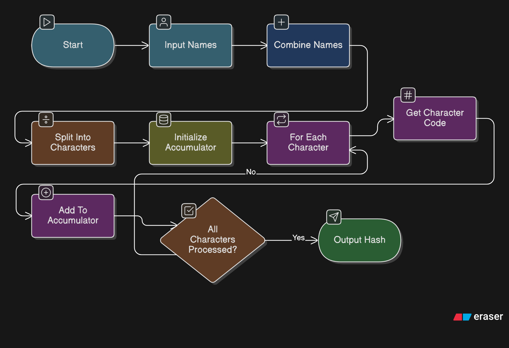

# ❤️ Love Calculator

The **Love Calculator** is a fun project that calculates the compatibility percentage between two names.

## 🌱 Purpose

This project was created to:

* Practice DOM manipulation and event handling in JavaScript.
* Experiment with CSS for styling and layout.

## 🧩 Structure

The project consists of the following files:

* `index.html`: The main HTML file that structures the application.
* `style.css`: The CSS file that styles the application.
* `script.js`: The JavaScript file that handles the logic for calculating compatibility.

## 🛠️ How It Works

1. The user enters two names in the input fields.
2. When the "Calculate" button is clicked, the `script.js` file processes the names.
3. A compatibility percentage is calculated based on a predefined algorithm.

4. The result is displayed dynamically on the page.

## 💬 Notes

This is a fun and lighthearted project meant for learning and experimentation. Feel free to explore, modify and improve it!